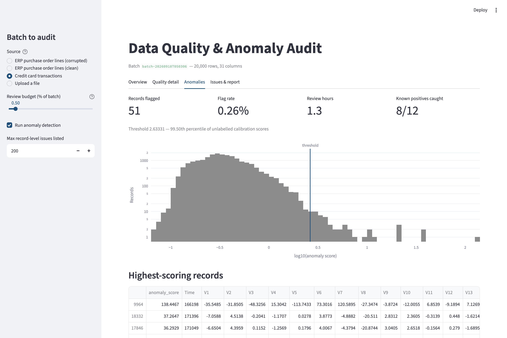
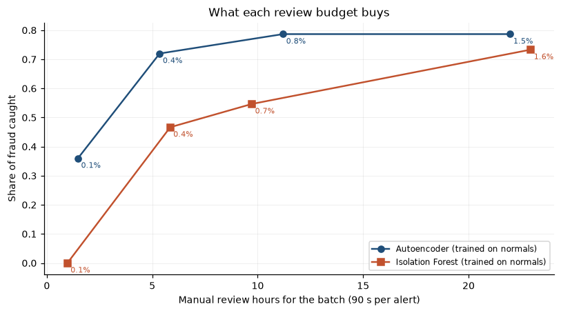
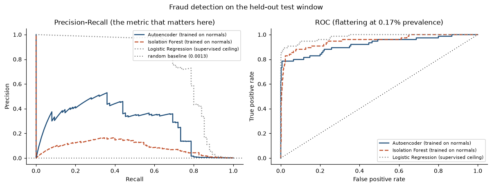
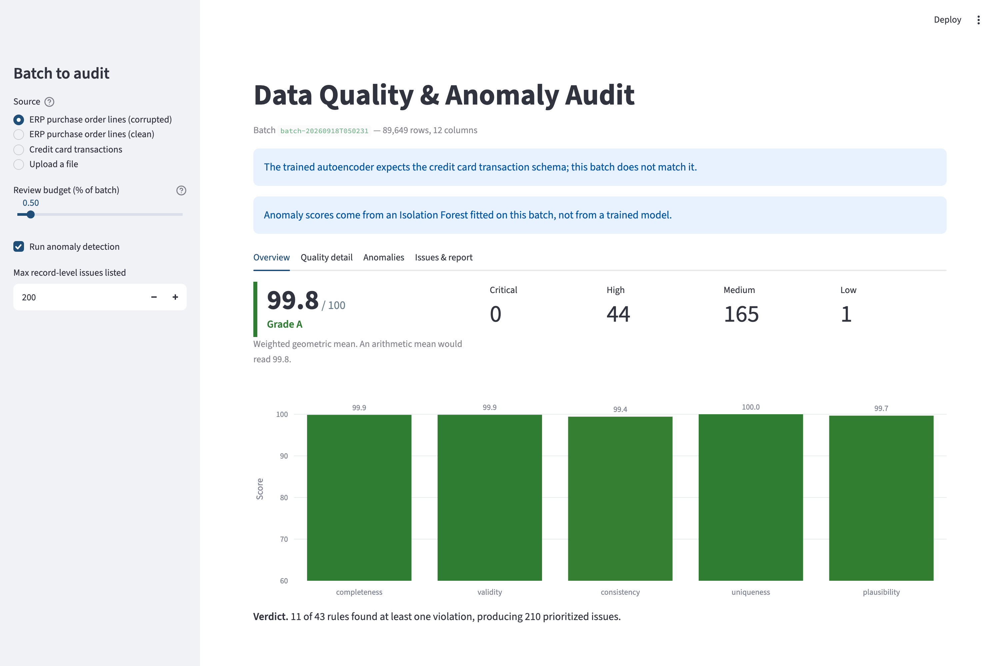
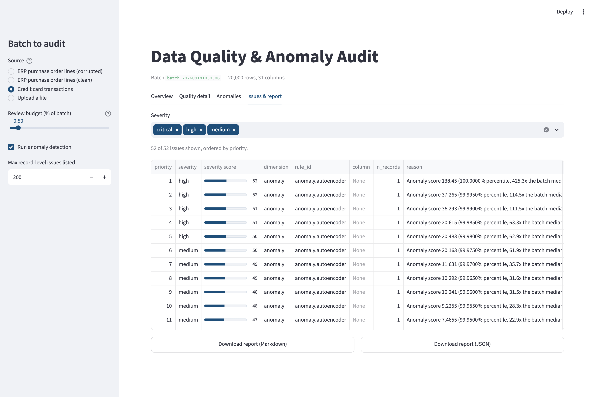

# Anomaly Detection & Data Quality Scoring for Financial and ERP Batches

An audit engine for large tabular business data. Point it at a batch and it returns
three things:

1. **A data quality score** for the batch — completeness, validity, consistency,
   uniqueness and plausibility, aggregated into one number and a letter grade.
2. **Record-level anomaly detection** with a deep model (autoencoder), benchmarked
   against a classical baseline (Isolation Forest) under an identical alert budget.
3. **A prioritized issue register** — every finding carries the reason it was raised,
   a computed severity, the records affected, and a recommended action.

It runs on two datasets: a real, labelled financial one (public credit card
transactions) and a synthetic SAP-style ERP extract (vendors, materials, BOMs,
purchase orders) that is deliberately corrupted so the quality engine itself can be
measured.



---

## Headline results

**Anomaly detection** — held-out temporal test window (56,962 transactions, 75 frauds,
0.13% prevalence), identical features, identical 0.5% alert budget:

| Model | PR-AUC | ROC-AUC | Precision | Recall | Alerts | Frauds caught |
| --- | ---: | ---: | ---: | ---: | ---: | ---: |
| Logistic Regression *(supervised ceiling)* | 0.778 | 0.981 | 0.228 | 0.853 | 281 | 64 / 75 |
| **Autoencoder** *(trained on normals)* | **0.287** | 0.920 | **0.252** | **0.720** | 214 | **54 / 75** |
| Isolation Forest *(trained on normals)* | 0.090 | 0.949 | 0.150 | 0.467 | 234 | 35 / 75 |
| Autoencoder *(fully unsupervised)* | 0.085 | 0.944 | 0.163 | 0.280 | 129 | 21 / 75 |
| Isolation Forest *(fully unsupervised)* | 0.076 | 0.949 | 0.123 | 0.320 | 195 | 24 / 75 |
| Random *(floor)* | 0.001 | 0.462 | 0.000 | 0.000 | 291 | 0 / 75 |

- The autoencoder delivers **3.2× the PR-AUC** of Isolation Forest and catches
  **54 frauds against 35** for the same reviewer effort — 5.3 hours of manual review
  versus 5.9.
- Bootstrap 95% intervals do not overlap (PR-AUC 0.189–0.396 vs 0.058–0.132), so the
  gap is larger than the noise in a window holding only 75 frauds.
- **Isolation Forest has the higher ROC-AUC and is the worse model.** That is the whole
  argument for reporting PR-AUC first; see [Why PR-AUC](#why-pr-auc-is-the-headline).

**Data quality engine** — measured against 4,665 deliberately injected ERP defects
across 14 failure families:

| Metric | Result |
| --- | ---: |
| Overall defect recall | **99.46%** (4,640 / 4,665) |
| Defect families recovered completely | 11 of 14 |
| Precision of the deterministic rules | **100%** |
| Rules evaluated per batch | 43 across 5 dimensions |

---

## Why these datasets

### Credit card transactions (real)

- **Source**: [OpenML dataset 1597](https://www.openml.org/d/1597) — the ULB /
  Worldline *Credit Card Fraud Detection* set, the same data distributed on Kaggle.
- **Licence**: Public (OpenML). Collected by the Machine Learning Group at Université
  Libre de Bruxelles in partnership with Worldline.
- **Shape**: 284,807 transactions over two days in September 2013; 492 fraudulent
  (0.172%); 28 PCA components plus `Time` and `Amount`; no missing values.
- **Why OpenML rather than Kaggle**: identical data, but no API credentials are
  required, so `make data` works on a fresh clone with nothing configured.
- **Why this dataset**: it is real, labelled, and extremely imbalanced. The labels are
  never used for training here — only to measure — which is exactly the situation a
  data quality function is in.

### Synthetic ERP extract (generated)

Six related tables generated with Faker under a fixed seed: `vendors` (300),
`materials` (5,000), `bom_headers` (1,200), `bom_lines` (8,923),
`purchase_orders` (20,000) and `po_lines` (89,649), with full referential integrity.

A second pass injects **4,665 defects across 14 families** and records every single
mutation in a ground-truth ledger (`data/synthetic/defect_ledger.csv`). The defects are
real ERP failure modes, not random noise: locale-confused numeric exports
(`1.234,00` landing in a quantity column), goods receipts against deleted materials,
hand-typed payment terms arriving as `net30` / `NET 30 days` / `N30`, purchase orders
duplicated by a re-run load job, delivery dates before their order date, net values
that no longer equal quantity × price.

**The ledger is the point.** Most data quality tooling can only describe a batch. With
a ground truth, the rules can be scored like any other detector — recall per defect
family, and precision per rule.

---

## Method

### Data quality scoring (independent of any model)

Five dimensions, each rule returning a 0–1 sub-score plus the exact index of the rows
it failed:

| Dimension | Checks |
| --- | --- |
| completeness | Null rates against a per-column declared tolerance; missing columns |
| validity | Type parseability, numeric and date ranges, controlled vocabularies, regex patterns |
| consistency | Cross-column arithmetic, date ordering, foreign keys, cross-table lookups |
| uniqueness | Exact row duplicates and primary-key collisions, reported separately |
| plausibility | Robust z-score (median / MAD) outliers |

Expectations are declared in YAML (`config/profile_*.yaml`) and validated with pydantic.
Cross-field rules are Python expressions parsed through an AST allowlist, so a profile
cannot smuggle in arbitrary code.

**Aggregation is a weighted geometric mean, not arithmetic.** Quality dimensions are
not substitutable: a batch with 100% duplicated keys is unusable no matter how complete
it is. An arithmetic mean scores that batch 85 — a solid B. The geometric mean refuses
to average one dead dimension away. Both numbers are emitted so the divergence is
visible.

Two hard overrides sit on top of the grade: a broken primary key forces **F**, and any
single dimension below 0.50 caps the grade at **D**. *"Your keys are broken"* is not a
gradeable condition.

### Anomaly detection

**Split.** Temporal, not random: the data is two consecutive days, so the model is
fitted on the earliest 60%, the threshold is calibrated on the next 20%, and the final
20% is scored exactly once. That is the real task — fit on history, score the batch
that arrives next.

**Features.** 31 dimensions: V1–V28 as-is, `log1p(Amount)`, and hour-of-day encoded as
`sin`/`cos` so 23:59 sits next to 00:01. Raw `Time` is deliberately dropped — it is a
monotone row index, meaningless for a future batch. Everything is standardised with a
scaler **fitted on the training normals only**; fitting it on the full dataset leaks
the anomalies into the definition of normal and is the most common source of inflated
results on this dataset.

**Model.** An undercomplete autoencoder, 31 → 24 → 16 → **8** → 16 → 24 → 31, ReLU
hidden layers and a **linear output head** (a sigmoid or tanh head saturates on
standardised inputs and clips precisely the extreme values that carry the signal).
Adam, MSE loss, early stopping on a held-out slice of the training normals. Anomaly
score = per-row mean squared reconstruction error. Trains in ~10 s on CPU.

**Baseline.** `IsolationForest(n_estimators=200, max_samples=8192)` fitted on the
identical rows and the identical feature matrix, so any difference is the algorithm.

**Threshold.** The headline operating point is a **review budget**: flag the top 0.5%
of the *unlabelled* calibration window. It uses no labels, it is the decision a real
team actually makes (how much can a reviewer clear in a day), and it holds every model
to the same alert volume so precision and recall are directly comparable.

The label-optimal threshold is computed too — and marked as an oracle everywhere it
appears, because quoting it as a result is the standard overstatement in unsupervised
fraud write-ups. For the record, it would inflate the autoencoder's F1 from 0.374 to
0.473.

A threshold taken from the *training* scores is also reported, to show why it is the
wrong choice: the model has already minimised error on those rows, so the cut-off comes
out optimistically low and flags **1.76% of the test window instead of the intended
0.5%** — three and a half times the alert volume the team budgeted for.

### Why PR-AUC is the headline

At 0.13% prevalence a random ranker scores ROC-AUC 0.500 but PR-AUC 0.0013. ROC-AUC is
dominated by the tens of thousands of negatives: pushing ten thousand false positives
from rank 50,000 down to rank 200,000 barely moves the false positive rate, yet it
completely changes what a reviewer sees at the top of the queue — and the top of the
queue *is* the product.

This project contains a clean demonstration: **Isolation Forest reports a higher
ROC-AUC (0.949 vs 0.920) while catching 35 frauds to the autoencoder's 54.** Ranking
the two on ROC-AUC would pick the worse model.

### Severity and prioritization

Severity is computed, not declared:

```
severity = 100 × dimension_weight_norm × (0.45 × impact + 0.30 × √extent + 0.25 × confidence)
```

`impact` is the intrinsic seriousness of the rule family (a duplicated primary key
scores 1.00, an outlier 0.35). `extent` is square-rooted on purpose — with a linear
term every realistic defect rate would round to "low", whereas a 1% breach of a
critical field plainly is not. `confidence` is 1.0 for deterministic rules and, for
model anomalies, scales with how far past the threshold the record sits.

---

## Results in detail

### What each review budget buys

| Review budget | Alerts | Review hours | Frauds caught | Recall | Precision |
| ---: | ---: | ---: | ---: | ---: | ---: |
| 0.10% | 59 | 1.5 | 27 | 0.360 | 0.458 |
| **0.38%** | **214** | **5.3** | **54** | **0.720** | **0.252** |
| 0.79% | 448 | 11.2 | 59 | 0.787 | 0.132 |
| 1.54% | 879 | 22.0 | 59 | 0.787 | 0.067 |

Doubling the review budget past 0.79% buys **no additional fraud at all** — it only
doubles the payroll. This is the conversation a data quality team actually has with its
business owner, and it is not visible in an F1 score.




### Quality engine against ground truth

| Defect family | Injected | Recovered | Recall |
| --- | ---: | ---: | ---: |
| MISSING_CRITICAL | 1,076 | 1,076 | 100% |
| ZERO_PRICE | 538 | 538 | 100% |
| TYPE_MISMATCH | 448 | 448 | 100% |
| NEGATIVE_QUANTITY | 359 | 359 | 100% |
| BROKEN_FK | 359 | 359 | 100% |
| DATE_ORDER_VIOLATION | 141 | 141 | 100% |
| DUPLICATE_ROW | 100 | 100 | 100% |
| ENCODING_NOISE | 50 | 50 | 100% |
| FUTURE_DATE | 40 | 40 | 100% |
| INVALID_CATEGORY | 6 | 6 | 100% |
| MISSING_OPTIONAL | 9 | 9 | 100% |
| INVALID_UOM | 717 | 715 | 99.7% |
| ARITHMETIC_INCONSISTENCY | 807 | 791 | 98.0% |
| OUT_OF_RANGE_PRICE | 15 | 8 | 53.3% |

The deterministic rules achieve **100% precision**: every cell they flag really was
corrupted. The statistical outlier rule recovers just over half of the fat-fingered
prices, with its remaining flags being legitimate extremes — which is why outliers
carry the lowest dimension weight and the lowest severity confidence. **An outlier is a
suspicion, not a violation.**

One tuning detail mattered a great deal: prices and quantities are log-normal, so a
robust z-score on the raw scale flags the *entire right tail* of a perfectly healthy
column. Computing it on the log scale cut false positives on `unit_price` from
**10,089 to 13** without losing a single true defect.

### The score is not the deliverable

The corrupted ERP tables score 99.7–99.9 out of 100 and mostly grade A, because 4,665
defects across ~115,000 rows is under 1%. A headline score will always look
reassuring at realistic defect rates.

`purchase_orders` is the exception: it scores 99.74 and grades **F**, because the
primary-key override fires on the duplicated order headers. That contrast is the
argument for the whole design — the number is a summary, the **prioritized issue
register** is what someone can act on.

---

## Running it

Requires Python 3.11 and [uv](https://docs.astral.sh/uv/). Everything else installs
from pinned versions.

```bash
make setup      # create .venv and install pinned dependencies
make data       # download the fraud dataset (73 MB) + generate the ERP extract
make train      # train the autoencoder and the baselines      (~90 s on CPU)
make evaluate   # comparison table, figures, defect-recall metrics
make report     # example batch reports into results/examples/
make test       # 52 tests
make app        # launch the Streamlit demo
```

Or in one step: `make all`.

> **macOS note.** On this machine every file `uv` installs inherits the BSD
> `hidden` flag, and CPython's `site` module skips hidden `.pth` files *silently* —
> so an editable install shows up in `pip list` and still fails to import. `make
> setup` clears the flag, and every script and the test suite put `src/` on the
> path themselves (`scripts/_bootstrap.py`), so nothing here depends on the
> editable install working.

### The demo

```bash
make app
```

Pick a bundled batch (corrupted ERP lines, clean ERP lines, or credit card
transactions) or upload your own CSV. The app shows the quality score and its dimension
breakdown, the anomaly score distribution with the threshold marked, the flagged
records, and the prioritized issue table — with the report downloadable as Markdown or
JSON.

Uploading an **arbitrary** CSV works: the app matches the column signature against the
bundled profiles and, failing a match, infers a profile from the data itself. In that
case it says so, because an inferred profile can only detect internal inconsistency,
never incorrectness. If the schema does not match the trained model, it falls back to
an Isolation Forest fitted on the uploaded batch and labels it as such rather than
pretending a trained model is running.

| Overview | Issue register |
| --- | --- |
|  |  |

### Command line

```bash
python -m dq_anomaly.cli audit --input data/synthetic/po_lines.csv \
    --profile profile_erp_po_lines.yaml --references data/synthetic --budget 0.005
```

---

## Layout

```
├── app/streamlit_app.py          Interactive demo
├── config/                       Expectation profiles, model and severity config (YAML)
├── notebooks/
│   ├── 01_eda_creditcard.ipynb           Exploration: prevalence, amount, time, PCA signal
│   ├── 02_baseline_vs_autoencoder.ipynb  Model comparison, honest vs oracle thresholds
│   └── 03_erp_quality_and_defect_recall.ipynb   Auditing the ERP batch and the auditor
├── scripts/                      01 download, 02 generate, 03 train, 04 evaluate,
│                                 05 report, 06 screenshots
├── src/dq_anomaly/
│   ├── anomaly/    preprocess, autoencoder, isolation_forest, thresholds, evaluate
│   ├── data/       loaders, erp_generator, defect_injector
│   ├── quality/    profile, rules, scorer, defect_eval
│   ├── report/     issues, builder
│   ├── pipeline.py Single audit entry point, shared by CLI / notebooks / app
│   └── cli.py
├── results/        metrics/, figures/, examples/   ← the deliverables, tracked in git
└── tests/          52 tests, no network, under 60 s
```

`data/`, `models/` and `.venv/` are gitignored — everything in them is regenerated by
`make all`.

---

## Design decisions worth defending

**Why not Great Expectations?** It pulls roughly 40 transitive dependencies, has no
upper pandas bound and is not validated against pandas 3's copy-on-write and default
string dtype (which is what this project runs on). More to the point, the contribution
here *is* the scoring logic — the 0–1 sub-scores, the aggregation, the grading, the
severity model — and that would have been written on top of Great Expectations anyway.
The rule ids follow GE's naming (`expect_column_values_to_not_be_null`) so a migration
would be mechanical.

**Why an autoencoder rather than a supervised classifier?** The supervised ceiling is in
the table above and it is far better — 0.778 PR-AUC against 0.287. That is the honest
finding, and it says something specific: if you have labels, use them. The premise of a
data quality gate is that you do not. Nobody has labelled which purchase order lines are
wrong, which is why the entire pipeline is trained without labels and uses them only to
measure.

**Why the autoencoder over Isolation Forest, beyond the metrics?** Reconstruction error
decomposes per feature, so a flagged record arrives with *which fields* made it
unusual — the input to a recommended action. Isolation Forest returns a score and
nothing else. That is why the autoencoder is the production model here even where the
metric gap is modest.

**Training longer made it worse.** Raising the epoch ceiling from 150 to 400 lowered
reconstruction loss but dropped PR-AUC from 0.287 to 0.280: the model starts
reconstructing the anomalies too. Lower loss is not the objective.

## Reproducibility

Every stage is seeded (`seed=42`, defect injection `seed=1337`) and the temporal split
uses a stable sort, because `Time` has many duplicate values and an unstable sort would
silently reshuffle tied rows between runs. Results are reproducible for a fixed torch
thread count (4); float reduction order changes with thread count, which is recorded in
`models/model_card.json` rather than papered over with a claim of universal determinism.
